# ragU --- Mermaid Diagrams

> Visual documentation of the ragU playground architecture, data flows, and system interactions.
> Render these with any Mermaid-compatible viewer (GitHub, VS Code, Obsidian, mermaid.live).

---

## Table of Contents

1. [C4 Context --- System Landscape](#1-c4-context--system-landscape)
2. [C4 Container --- Services & Stores](#2-c4-container--services--stores)
3. [C4 Component --- RAG Backend Internals](#3-c4-component--rag-backend-internals)
4. [C4 Component --- Frontend Internals](#4-c4-component--frontend-internals)
5. [Sequence --- Chat Message with RAG](#5-sequence--chat-message-with-rag)
6. [Sequence --- Document Upload from Chat](#6-sequence--document-upload-from-chat)
7. [Sequence --- Hybrid Search (RRF Fusion)](#7-sequence--hybrid-search-rrf-fusion)
8. [Flow --- Document Ingestion Pipeline](#8-flow--document-ingestion-pipeline)
9. [Flow --- Vector Store Mode Selection](#9-flow--vector-store-mode-selection)
10. [Flow --- Startup Bootstrap (Hybrid Mode)](#10-flow--startup-bootstrap-hybrid-mode)
11. [State --- Ingestion Job Lifecycle](#11-state--ingestion-job-lifecycle)
12. [Flow --- Graceful Degradation](#12-flow--graceful-degradation)

---

## 1. C4 Context --- System Landscape

Who interacts with ragU and what are the system boundaries.

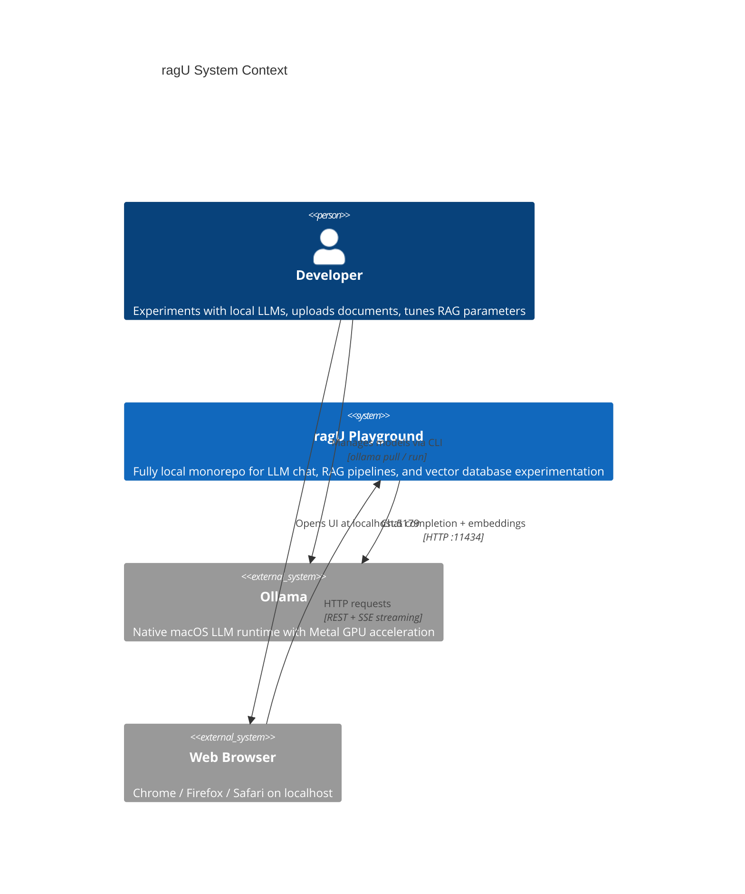

---

## 2. C4 Container --- Services & Stores

All containers/services and how they communicate.

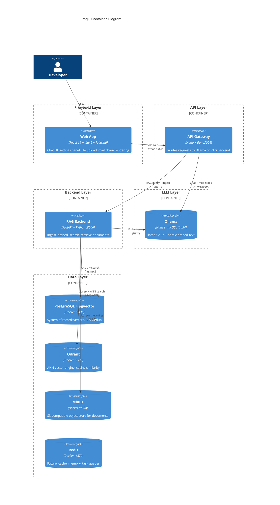

---

## 3. C4 Component --- RAG Backend Internals

Inside the FastAPI RAG service: routers, services, and stores.

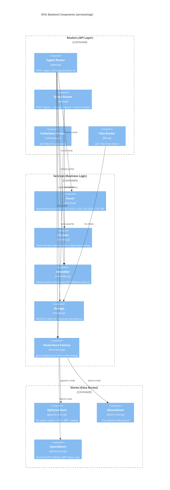

---

## 4. C4 Component --- Frontend Internals

Inside the React web app: components, hooks, and state stores.

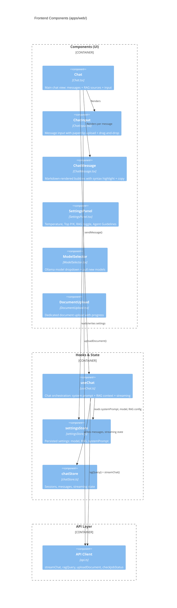

---

## 5. Sequence --- Chat Message with RAG

The full journey of a user message when RAG mode is enabled.

```mermaid
sequenceDiagram
    autonumber
    actor User
    participant UI as React Frontend
    participant Hook as useChat Hook
    participant GW as Gateway (Hono)
    participant RAG as RAG Backend (FastAPI)
    participant Ollama as Ollama (native)
    participant PG as PostgreSQL + pgvector
    participant QD as Qdrant

    User->>UI: Types message + presses Enter
    UI->>Hook: sendMessage(text)

    Note over Hook: Check if RAG is enabled

    rect rgb(40, 40, 80)
        Note right of Hook: RAG Context Retrieval
        Hook->>GW: POST /api/rag/query {question, collection, top_k}
        GW->>RAG: POST /query
        RAG->>Ollama: POST /api/embeddings {model, prompt}
        Ollama-->>RAG: float[768] embedding vector

        alt VECTOR_DB = hybrid
            par Qdrant ANN Search
                RAG->>QD: search(vector, limit=top_k)
                QD-->>RAG: vec_results[] with scores
            and PG Keyword Search
                RAG->>PG: SELECT ... tsvector @@ tsquery
                PG-->>RAG: kw_results[] with ranks
            end
            Note over RAG: RRF Fusion<br/>score = 1/(60+vec_rank) + 1.5/(60+kw_rank)
        else VECTOR_DB = pgvector
            RAG->>PG: Vector search + FTS + RRF (SQL)
            PG-->>RAG: fused results[]
        else VECTOR_DB = qdrant
            RAG->>QD: ANN search only
            QD-->>RAG: results[]
        end

        RAG-->>GW: {context, sources[]}
        GW-->>Hook: RAG context + source metadata
    end

    Note over Hook: Build message array

    rect rgb(40, 80, 40)
        Note right of Hook: LLM Streaming
        Hook->>Hook: Combine [system_prompt + RAG_context, ...history, user_msg]
        Hook->>GW: POST /api/chat {messages, model, stream: true}
        GW->>Ollama: POST /api/chat (stream)

        loop SSE chunks
            Ollama-->>GW: {message.content: "chunk..."}
            GW-->>UI: SSE data chunk
            UI->>UI: Append to message bubble (real-time)
        end

        Ollama-->>GW: {done: true}
        GW-->>UI: Stream complete
    end

    UI->>User: Rendered markdown response + RAG sources
```

---

## 6. Sequence --- Document Upload from Chat

What happens when a user attaches a file via the paperclip button or drag-and-drop.

```mermaid
sequenceDiagram
    autonumber
    actor User
    participant UI as ChatInput Component
    participant GW as Gateway (Hono)
    participant RAG as RAG Backend (FastAPI)
    participant MinIO as MinIO (S3)
    participant Ollama as Ollama
    participant Store as Vector Store

    User->>UI: Clicks paperclip / drags file
    UI->>UI: Show status chip: "document.pdf" + spinner

    UI->>GW: POST /api/documents/upload (multipart)
    GW->>RAG: POST /ingest (file + collection)

    RAG->>MinIO: PUT object {collection}/{uuid}_{filename}
    MinIO-->>RAG: 200 OK (file stored)

    RAG->>RAG: asyncio.create_task(background_process)
    RAG-->>GW: 202 Accepted {job_id}
    GW-->>UI: {job_id}

    rect rgb(60, 40, 40)
        Note right of RAG: Background Processing
        RAG->>RAG: extract_text(file) via Parser
        Note over RAG: PyMuPDF for PDF<br/>python-docx for DOCX<br/>openpyxl for XLSX
        RAG->>RAG: chunk_text(content, size=500, overlap=50)
        RAG->>Ollama: POST /api/embeddings (batch of chunks)
        Ollama-->>RAG: float[768][] embedding vectors

        alt hybrid mode
            RAG->>Store: add_returning_ids() into PG
            Store->>Store: INSERT ... ON CONFLICT (dedup)
            Store-->>RAG: int[] PG IDs
            RAG->>Store: Qdrant upsert (PG IDs as point IDs)
        else pgvector mode
            RAG->>Store: INSERT with SHA-256 dedup
        else qdrant mode
            RAG->>Store: Qdrant upsert with UUID IDs
        end
    end

    loop Poll every 1.5s
        UI->>GW: GET /api/documents/status/{job_id}
        GW->>RAG: GET /ingest/status/{job_id}
        RAG-->>GW: {status: "processing", chunks: N}
        GW-->>UI: status update
        UI->>UI: Update chip: "document.pdf (42 chunks)"
    end

    RAG-->>GW: {status: "completed", chunks: 42}
    GW-->>UI: Job complete
    UI->>UI: Show green checkmark on chip
    UI->>User: File ready for RAG queries
```

---

## 7. Sequence --- Hybrid Search (RRF Fusion)

Detailed view of how hybrid mode combines Qdrant ANN and PG keyword search.

```mermaid
sequenceDiagram
    autonumber
    participant Client as Query Router
    participant HS as HybridStore
    participant QD as Qdrant (ANN)
    participant PG as PgVectorStore (FTS)

    Client->>HS: search(collection, query_embedding, query_text, top_k=5)

    par Vector Search (Qdrant)
        HS->>QD: search(collection, query_embedding, limit=top_k*2)
        Note over QD: HNSW ANN cosine similarity
        QD-->>HS: vec_results[{id, score, content}]
    and Keyword Search (PostgreSQL)
        HS->>PG: keyword_search(collection, query_text, limit=top_k*2)
        Note over PG: tsvector @@ plainto_tsquery<br/>ts_rank_cd scoring
        PG-->>HS: kw_results[{id, rank, content}]
    end

    Note over HS: Build rank maps

    rect rgb(50, 50, 30)
        Note over HS: Reciprocal Rank Fusion (RRF)
        HS->>HS: vec_ranks = {doc_id: position} from vec_results
        HS->>HS: kw_ranks = {doc_id: position} from kw_results
        HS->>HS: all_ids = union(vec_ranks.keys, kw_ranks.keys)

        loop For each document ID
            HS->>HS: vec_rank = vec_ranks.get(id, top_k*2+1)
            HS->>HS: kw_rank = kw_ranks.get(id, top_k*2+1)
            HS->>HS: score = 1/(60 + vec_rank) + 1.5/(60 + kw_rank)
        end

        HS->>HS: Sort by RRF score descending
        HS->>HS: Return top_k results
    end

    HS-->>Client: fused_results[{content, metadata, score}]
```

---

## 8. Flow --- Document Ingestion Pipeline

Decision tree for the full ingestion flow from file to vectors.

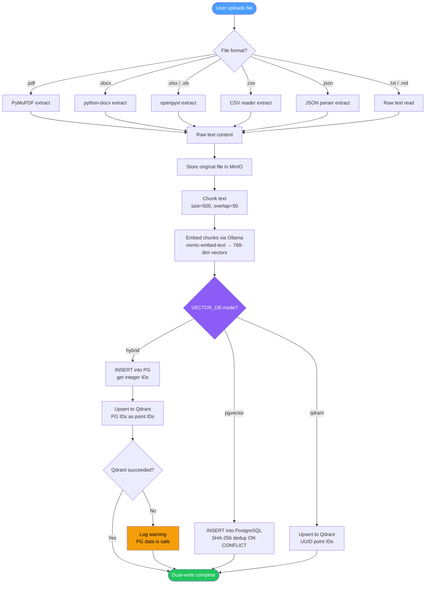

---

## 9. Flow --- Vector Store Mode Selection

How `get_store()` factory routes to the correct implementation.

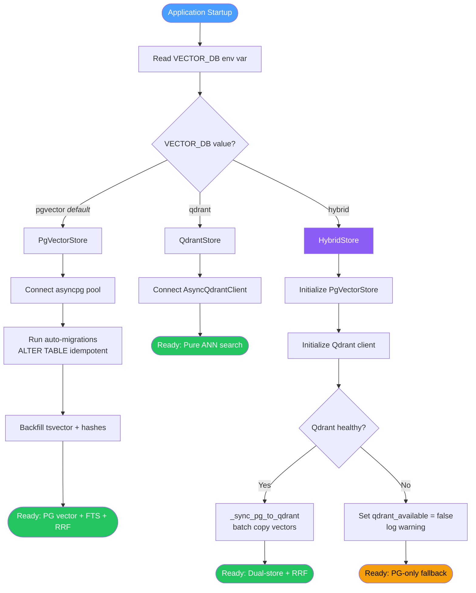

---

## 10. Flow --- Startup Bootstrap (Hybrid Mode)

The sync process that copies pgvector data into Qdrant on first hybrid boot.

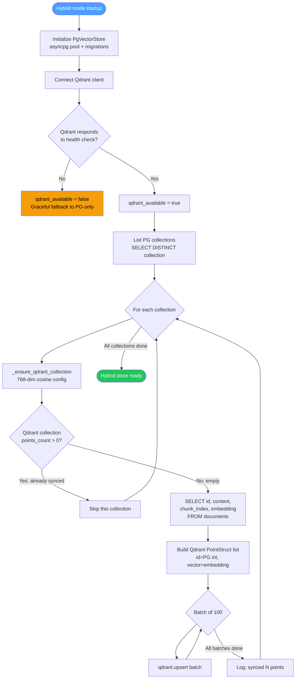

---

## 11. State --- Ingestion Job Lifecycle

State machine for background document processing jobs.

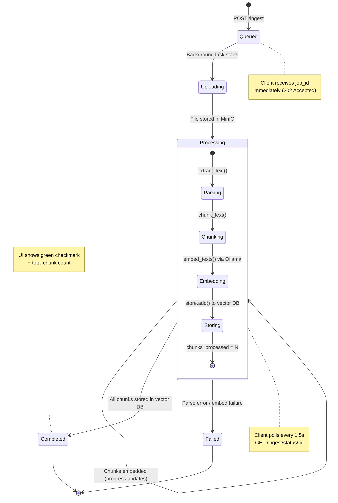

---

## 12. Flow --- Graceful Degradation

How hybrid mode handles Qdrant failures without losing data.

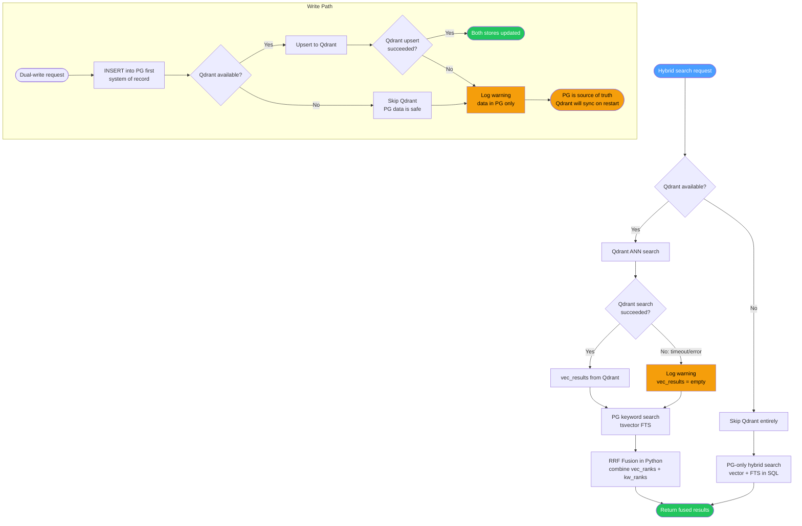

---

## How to View These Diagrams

| Tool | How |
|------|-----|
| **GitHub** | Push this file --- GitHub renders Mermaid natively in markdown |
| **VS Code** | Install [Markdown Preview Mermaid](https://marketplace.visualstudio.com/items?itemName=bierner.markdown-mermaid) extension |
| **Obsidian** | Built-in Mermaid support |
| **mermaid.live** | Paste any diagram block at [mermaid.live](https://mermaid.live) |
| **CLI** | `npx @mermaid-js/mermaid-cli mmdc -i DIAGRAMS.md -o output.svg` |

---

  Part of the <a href="README.md">ragU</a> playground &mdash; <a href="ARCHITECTURE.md">Architecture</a> &middot; <a href="DIAGRAMS.md">Diagrams</a>

